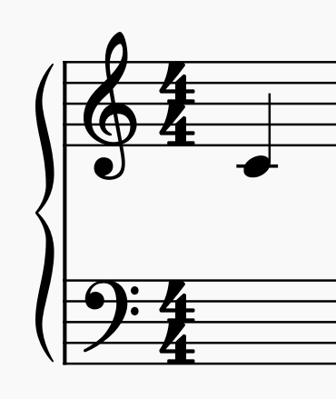
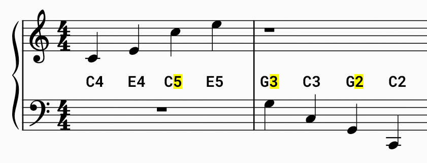
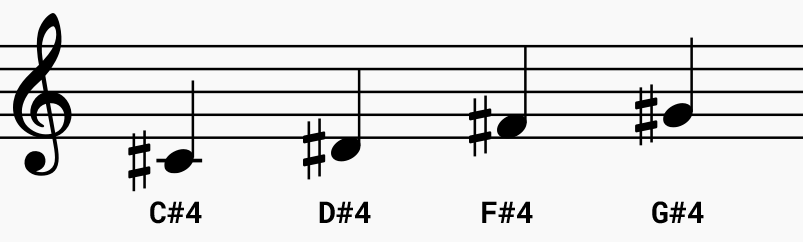
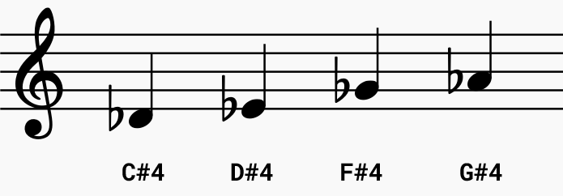

The `picozero` library allows you to enter real musical notes to make tunes to play on your speaker. A coding system has been created to help you with this. 

The coding system uses a **letter** to represent the musical note and a **number** to represent where the note appears on the grand stave (staff). 

For example, the **middle C** (see above) is at the centre of the grand stave and uses the code `c4`.

+ A **high C** uses the code `c5`
+ A **low C** uses the code `c3`

When you go up the grand stave, the number increases. When you go down the grand stave, the number decreases. 

**Representing sharps**

Your musical score might include notes that are **sharps**. These are represented using a `#` symbol. In the example below, the first note is a C sharp. The code for this is `c#4`. 

**Representing flats**

Your musical score might include notes that are **flats**. These are **also** represented using a `#` because the library doesn't have a specific code for flats. To turn a flat into a sharp you need to go down the scale. 

+ A **D flat** becomes a **C sharp** or `c#4`
+ An **E flat** becomes a **D sharp** or `d#4`
+ A **G flat** becomes an **F sharp** or `f#4`
+ An **A flat** becomes a **G sharp** or `g#4`

