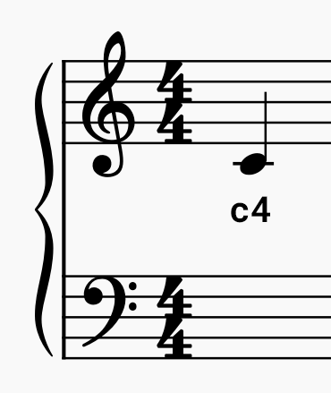
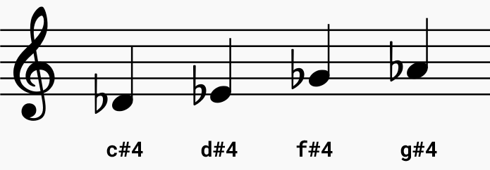

La bibliothèque `picozero` te permet d'entrer de vraies notes de musique pour créer des mélodies à écouter sur tes haut-parleurs.

Une **lettre** est utilisée pour représenter la note de musique et un **numéro** est utilisé pour représenter l'endroit où la note apparaît sur la portée musicale.

Par exemple, le **middle C** (do central) (ci-dessus) est au centre de la portée et utilise `c4`.

En remontant la portée, le nombre augmente. En descendant la portée, le nombre diminue.

**Représenter les dièses**

Ta partition de musique peut inclure des notes qui sont des **dièses**. Elles sont représentées par le symbole `#`. Dans l'exemple ci-dessous, la première note est un C sharp (do dièse). Un C sharp est `c#4`.

**Représenter les bémols**

Ta partition de musique peut inclure des notes qui sont des **bémols**. Celles-ci sont **aussi** représentées par un `#` car la bibliothèque n'a pas de code spécifique pour les bémols. Pour transformer un bémol en dièse, il faut descendre dans l'échelle.

+ Le **D flat** (ré bémol) devient un **C sharp** (do dièse) ou `c#4`
+ Un **E flat** (mi bémol) devient un **D sharp** (ré dièse) ou `d#4`
+ Le **G flat** (sol bémol) devient un **F sharp** (fa dièse) ou `f#4`
+ Un **A flat** (la bémol) devient un **G sharp** (sol dièse) ou `g#4`

