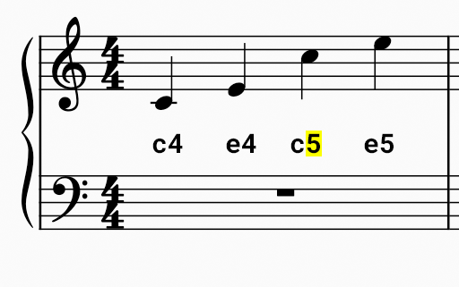
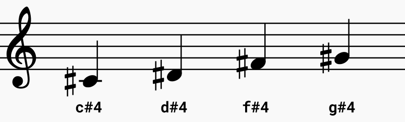

Met de `picozero` bibliotheek kun je echte muzieknoten invoeren om deuntjes te maken die op je luidspreker kunnen worden afgespeeld.

Een **letter** wordt gebruikt om de muzieknoot weer te geven en een **cijfer** wordt gebruikt om aan te geven waar de noot op de grote notenbalk verschijnt.

De **middelste C** (hierboven) bevindt zich bijvoorbeeld in het midden van de grote notenbalk en gebruikt als code `c4`.

Wanneer je in de grote notenbalk hogere toon kiest dan neemt het nummer toe. Wanneer je in de grote notenbalk lagere toon kiest dan neemt het nummer af.

**Weergeven van kruizen**

Je partituur kan noten bevatten die **kruizen** zijn. Deze worden weergegeven met een `#`-symbool. In het onderstaande voorbeeld is de eerste noot een Cis. Een Cis is `c#4`.

**Weergeven van mollen**

Je partituur kan noten bevatten die **mollen** zijn. Dit wordt **ook** weergegeven met een `#` omdat de bibliotheek geen specifieke code voor mollen heeft. Om een mol in een kruis te veranderen moet je de code voor het naastliggende lagere kruis gebruiken.

+ Een **D mol** wordt een **Cis** of `c#4`
+ Een **E mol** wordt een **D kruis** of `d#4`
+ Een **G mol** wordt een **Fis** of `f#4`
+ Een **A mol** wordt een **G kruis** of `g#4`

