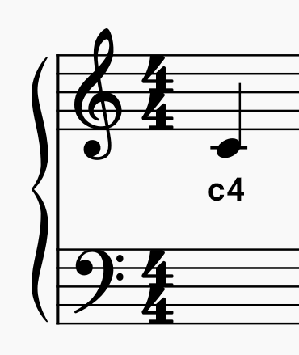

Met de `picozero` bibliotheek kun je echte muzieknoten invoeren om deuntjes te maken die op je luidspreker kunnen worden afgespeeld.

Een **letter** wordt gebruikt om de muzieknoot weer te geven en een **cijfer** wordt gebruikt om aan te geven waar de noot op de grote notenbalk verschijnt.

De **middelste C** (hierboven) bevindt zich bijvoorbeeld in het midden van de grote notenbalk en gebruikt als code `c4`.

When you go up the grand stave, the number increases. When you go down the grand stave, the number decreases.

**Representing sharps**

Your musical score might include notes that are **sharps**. These are represented using a `#` symbol. In the example below, the first note is a C sharp. A C sharp is `c#4`.

**Representing flats**

Your musical score might include notes that are **flats**. These are **also** represented using a `#` because the library doesn't have a specific code for flats. To turn a flat into a sharp you need to go down the scale.

+ A **D flat** becomes a **C sharp** or `c#4`
+ An **E flat** becomes a **D sharp** or `d#4`
+ A **G flat** becomes an **F sharp** or `f#4`
+ An **A flat** becomes a **G sharp** or `g#4`

